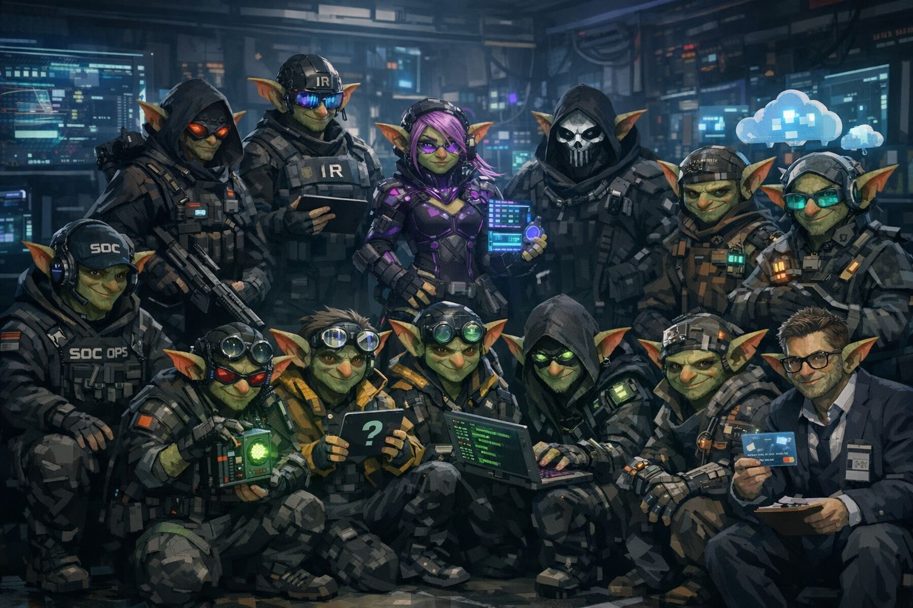

# CyberSquad

Virtual cybersecurity squad for prompt-based day-to-day operations.



CyberSquad gives you a ready squad of cybersecurity specialists (SOC, Threat Hunter, CTI, IR, Detection, Detection QA, SecEng, AppSec, Pentester, Malware, VulnOps, CloudSec, Fraud, GRC) with practical prompt templates and an installable CLI for operations and study workflows.

## Why this structure

Inspired by strong ideas from `opensquad`, this project now includes:

- Installable CLI (`cybersquad`) for workspace bootstrap
- Versioned internal workspace folder (`_cybersquad/`)
- Template-based installation for consistent onboarding
- `doctor` command for fast environment validation
- Prompt library + persona evolution playbooks

## Quick Start

### Option 1: local repo (fastest)

```bash
./bin/cybersquad init ./my-cybersquad
cd ./my-cybersquad
```

Windows (local repo):

```powershell
.\bin\cybersquad.cmd init .\my-cybersquad
cd .\my-cybersquad
```

### Option 2: install as Python package

```bash
python3 -m pip install .
cybersquad init ./my-cybersquad
```

Windows:

```powershell
py -m pip install .
py -m cybersquad init .\my-cybersquad
```

If your `pip` is older and editable mode fails, use normal install:

```bash
python3 -m pip install .
```

### Option 3: install from Git

```bash
python3 -m pip install "git+https://github.com/your-org/cybersquad.git"
cybersquad init ./my-cybersquad
```

Windows:

```powershell
py -m pip install "git+https://github.com/your-org/cybersquad.git"
py -m cybersquad init .\my-cybersquad
```

## Commands

| Command | Purpose |
|---|---|
| `cybersquad init <path>` | Create a ready CyberSquad workspace |
| `cybersquad list personas` | List available personas |
| `cybersquad list prompts` | List available prompt templates |
| `cybersquad generate prompts` | Generate persona usage prompts from `personas.yaml` |
| `cybersquad sync-template` | Sync source prompts/personas into packaged template (maintainers) |
| `cybersquad doctor` | Validate workspace integrity |
| `cybersquad version` | Show installed version |

Examples:

```bash
cybersquad list personas --from-template
cybersquad generate prompts --workspace . --overwrite
cybersquad init . --force --language en-US
cybersquad doctor --workspace .
```

## Installed Workspace Layout

```text
my-cybersquad/
  personas.yaml
  prompts/
    master-prompt.md
    persona-prompts.md
    persona-prompts.generated.md
    persona-skill-upgrades.md
    study-attack-perspectives.md
    study-learning-path.md
    personas/
      atlas_soc-atlas-soc.md
      ...
    triage.md
    incident.md
    ...
  _cybersquad/
    .cybersquad-version
    config.yaml
    _memory/
      preferences.md
```

## Daily Workflow

1. Open `prompts/master-prompt.md`
2. Pick role usage from `prompts/persona-prompts.generated.md` (or use curated `persona-prompts.md`)
3. Run a scenario template (`triage`, `incident`, `vuln-prioritization`, etc.)
4. Run weekly optimization using `prompts/persona-skill-upgrades.md`

Note: `persona-prompts.generated.md` and `prompts/personas/*.md` are generated during `cybersquad init` (and by `cybersquad generate prompts`). They are not packaged as static template files.

## Study Workflow

1. Open `prompts/study-attack-perspectives.md` for topic deep-dive with multiple personas.
2. Ask each role for offensive intent (high-level), defense, detection, and response view.
3. Request ATT&CK/kill chain mapping and lab-safe exercises.
4. Use `prompts/study-learning-path.md` to build a 30/60/90 study roadmap.

## For Contributors

- Prompt authoring source files live in project root (`personas.yaml`, `prompts/`)
- Install template lives in `src/cybersquad/template/`
- Regenerate and sync prompt artifacts:

```bash
./scripts/rebuild-prompts.sh
```

Windows maintainers:

```powershell
.\scripts\rebuild-prompts.ps1
```

macOS/Linux maintainers:

```bash
./scripts/rebuild-prompts.sh
```

See [CONTRIBUTING.md](CONTRIBUTING.md), [docs/INSTALL.md](docs/INSTALL.md), and [docs/ARCHITECTURE.md](docs/ARCHITECTURE.md).

Also see [docs/OPENSQUAD-INSIGHTS.md](docs/OPENSQUAD-INSIGHTS.md) for the design choices borrowed and adapted from opensquad.

For copy/paste workflows, see [docs/EXAMPLES.md](docs/EXAMPLES.md).
