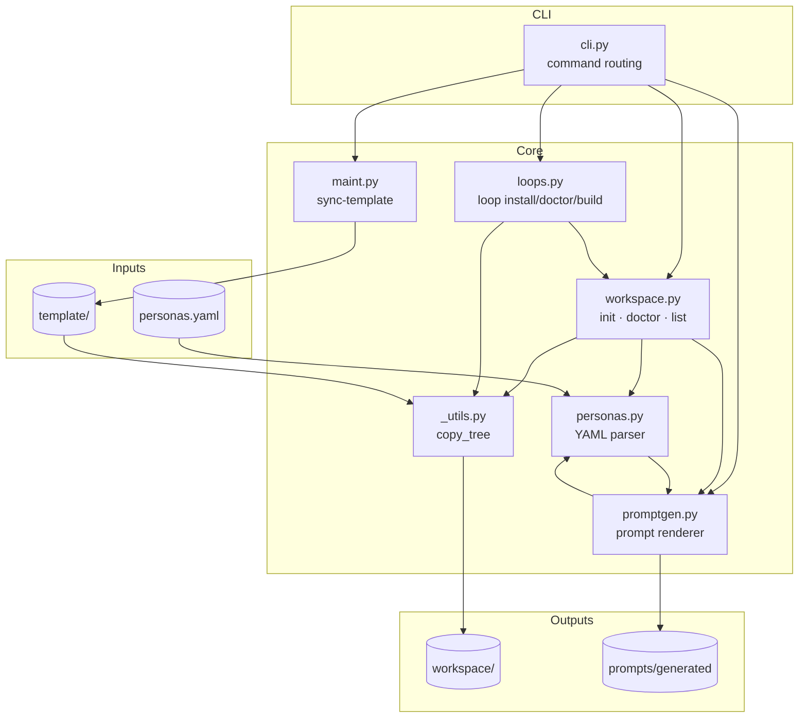

# Architecture

CyberSquad is intentionally file-first and lightweight.

## Module dependency and data flow



## Core modules

- `src/cybersquad/cli.py`
  - Command routing and argument parsing.
- `src/cybersquad/workspace.py`
  - Workspace bootstrap (`init`), prompt listing, and health check (`doctor`).
- `src/cybersquad/personas.py`
  - Persona parsing from `personas.yaml` into typed `Persona` objects (id, name, role, seniority, mission, core_expertise, technical_skills, responsibilities, consult_when, outputs, escalation_triggers).
- `src/cybersquad/promptgen.py`
  - Prompt generation engine: renders per-persona and combined usage docs from parsed personas.
- `src/cybersquad/maint.py`
  - Maintainer workflow to regenerate artifacts and sync packaged template.
- `src/cybersquad/loops.py`
  - Ralph-style loop installer, doctor checks, overview, and build runner wrappers.
- `src/cybersquad/_utils.py`
  - Shared utilities (recursive template copy helper used by `workspace.py` and `loops.py`).

## Workspace model

A generated workspace contains:

- `personas.yaml`
- `prompts/` templates
- `opencti/` optional homelab stack templates (`docker-compose.yml`, `.env.example`)
- `_cybersquad/` internal state and version marker
- `.agents/ralph/` loop runtime templates
- `.agents/tasks/prd.json` loop backlog/state source
- `.ralph/` loop memory (progress, guardrails, activity, errors, runs)

Study templates are included in `prompts/`:

- `study-attack-perspectives.md`
- `study-learning-path.md`

## Prompt generation flow

Source of truth:

- `personas.yaml`
- `src/cybersquad/template/personas.yaml` is a synced packaging artifact

Generated artifacts:

- `prompts/persona-prompts.generated.md`
- `prompts/personas/*.md`

Generation behavior:

- During `cybersquad init`, generated persona prompt artifacts are created in the target workspace.
- The packaged template intentionally excludes generated persona prompt artifacts to avoid duplicated tracked trees.

Commands:

```bash
cybersquad generate prompts --workspace . --overwrite
cybersquad sync-template --repo-root . --overwrite
```

## Template sync flow

Maintainers should run:

```bash
cybersquad sync-template --repo-root . --overwrite
```

This does:

1. sync `personas.yaml` into `src/cybersquad/template/`
2. sync source prompt templates into `src/cybersquad/template/prompts/`
3. sync optional OpenCTI lab assets from `opencti/` into `src/cybersquad/template/opencti/`
4. exclude generated prompt artifacts (`persona-prompts.generated.md` and `prompts/personas/`)

## Design principles

- Keep onboarding to one command
- Prefer plain files over runtime infrastructure
- Keep prompt assets portable and readable
- Keep generation deterministic and reproducible
